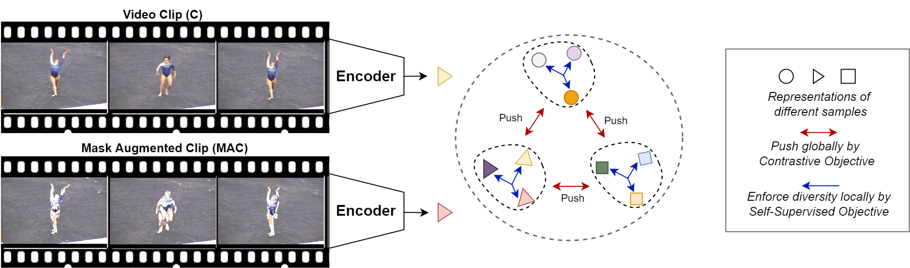
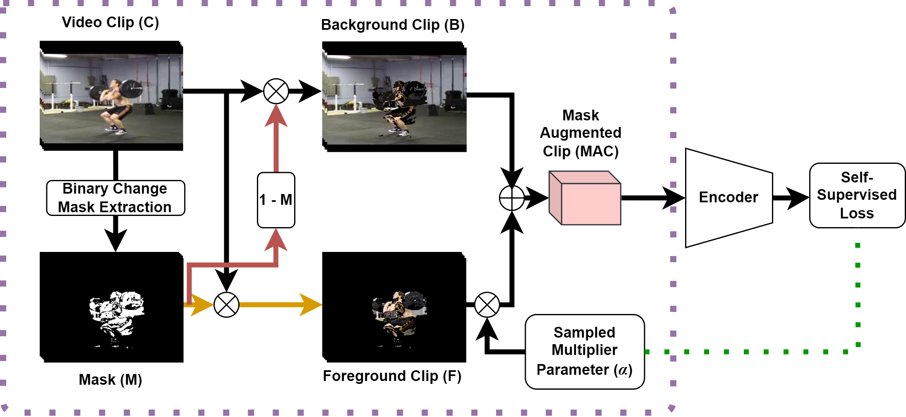

## Unsupervised Video Representation Learning by Catch-the-Patch

### Introduction

This is the codebase for the paper "**MAC: Mask-Augmentation for Motion-Aware Video Representation Learning**".

If you find our work useful in your research please consider citing our paper:
```
@inproceedings{macssl,
  title={MAC: Mask-Augmentation for Motion-Aware Video Representation Learning},
  author={Akar, Arif and Senturk, Ufuk Umut and Ikizler-Cinbis, Nazli},
  booktitle={BMVC},
  year={2022}
}
```



### Getting Started

#### Installation

You can install some necessary libraries with conda.

  ```bash
  # Step 0, create a new python environment
  conda create -n mac python=3.7
  conda activate mac
  
  # Step 1, install mmcv with torch 1.8, cuda 11.1 
pip install mmcv-full==1.3.7 -f https://download.openmmlab.com/mmcv/dist/cu111/torch1.8.0/index.html

  # Step 2, install tensorboard
  pip install tensorboard
  ```

#### Data Preparation

##### UCF-101

1. Download the compressed file of raw videos from the official website. 

   ```bash
   mkdir -p data/ucf101/
   wget https://www.crcv.ucf.edu/data/UCF101/UCF101.rar -O data/ucf101/UCF101.rar --no-check-certificate 
   ```

2. Unzip the compressed file.

   ```bash
   # install unrar if necessary 
   # sudo apt-get install unrar
   unrar e data/ucf101/UCF101.rar data/ucf101/UCF101_raw/
   ```

3. Download train/test split file

   ```bash
   wget https://www.crcv.ucf.edu/data/UCF101/UCF101TrainTestSplits-RecognitionTask.zip -O data/ucf101/UCF101TrainTestSplits-RecognitionTask.zip --no-check-certificate
   unzip data/ucf101/UCF101TrainTestSplits-RecognitionTask.zip -d data/ucf101/.
   ```

4. Run the preprocessing script (it takes about 1hours to extract raw frames).

   ```bash
   python scripts/process_ucf101.py --raw_dir data/ucf101/UCF101_raw/ --ann_dir data/ucf101/ucfTrainTestlist/ --out_dir data/ucf101/
   ```

5. (Optional) The generated annotation file is in format of .txt. One can convert it into the json format by `scripts/cvt_txt_to_json.py`.

6. (Optional) delete raw videos to save disk space.

   ```bash
   rm data/ucf101/UCF101.rar
   rm -r data/ucf101/UCF101_raw/
   ```

##### HMDB-51

1. Download the compressed file of raw videos from the official website.

   ```bash
   mkdir -p data/hmdb51/
   wget http://serre-lab.clps.brown.edu/wp-content/uploads/2013/10/hmdb51_org.rar -O data/hmdb51/HMDB51.rar --no-check-certificate 
   ```

2. Unzip the compressed file.

   ```bash
   unrar e data/hmdb51/HMDB51.rar data/hmdb51/HMDB51_raw/
   for file in data/hmdb51/HMDB51_raw/*.rar; do unrar e ${file} ${file%".rar"}/; done
   ```

3. Download train/test split file.

   ```bash
   wget http://serre-lab.clps.brown.edu/wp-content/uploads/2013/10/test_train_splits.rar -O data/hmdb51/test_train_splits.rar --no-check-certificate
   unrar e data/hmdb51/test_train_splits.rar data/hmdb51/test_train_splits/
   ```

4. Run the preprocessing script (it takes about 20 mins to extract raw frames).

   ```bash
   python scripts/process_ucf101.py --raw_dir data/hmdb51/HMDB51_raw/ --ann_dir data/hmdb51/test_train_splits/ --out_dir data/hmdb51/
   ```

5. (Optional) delete raw videos to save disk space.

   ```bash
   rm data/hmdb51/HMDB51.rar
   rm -r data/hmdb51/HMDB51_raw/
   ```

##### Kinetics

Since Kinetics-400/600 dataset is relatively large, we do not provide the download script and the preprocessing script here.

You can easily follow the building instruction just like UCF-101. The raw video frames are extracted from the video file and they are further saved in a compressed .zip file.


**You can alternatively implement your own storage backend, as like `src/datasets/backends/zip_backend.py`
If you do not want to use zip backend, one can use `src/datasets/backends/jpeg_backend.py`
We provide subset of mini K400 backend `src/datasets/backends/mini_k400.py` as well. 

#### CoT Pretraining

If you want a distributed pretraining for a CoT-2 model on UCF-101 dataset:

```bash
python -m torch.distributed.launch --master_port=<PORT_NUMBER> --nproc_per_node=<GPU_NUMBER> 
    ./tools/train_net.py --validate --cfg ./configs/mac2_moco/r2plus1d_18_ucf101/pretraining.py 
    --work_dir <WORKING_DIRECTORY> --data_dir  <DATASET_DIRECTORY> --launcher pytorch
```

The checkpoints and logs will be saved in the `work_dir`. If you do clarify `work_dir` as above, it will use 
`work_dir` defined in configuration file. `--validate` only refers to validation for self supervised objective.
Our models are trained 300 epochs for UCF-101.

#### Action Recognition

After pretraining, one can use the CoT-pretrained model to initialize the action recognizer. 
The checkpoint path is defined in the key of `model.backbone.pretrained`. 
Our models are trained 150 epochs for UCF-101.

**Model Training (with validation):**

```bash
python -m torch.distributed.launch --master_port=<PORT_NUMBER> --nproc_per_node=<GPU_NUMBER> 
    ./tools/train_net.py --validate --cfg ./configs/mac2_moco/r2plus1d_18_ucf101/finetune_ucf101.py 
    --work_dir <WORKING_DIRECTORY> --data_dir  <DATASET_DIRECTORY> --launcher pytorch
```

**Model evaluation:**

```bash
python ./tools/test_net.py --cfg ./configs/mac2_moco/r2plus1d_18_ucf101/eval_ucf101.py 
--data_dir <DATASET_DIRECTORY> --progress
```
#### Video Retrieval

One can run video retrieval on UCF-101 below command with CoT-4 model:
```bash
python. /tools/retrieve.py --checkpoint <MODEL_PATH> --work_dir <WORKING_DIRECTORY> --data_dir <DATASET_DIRECTORY>
--cfg ./configs/mac4_moco/r2plus1d_18_kinetics/retrieve_ucf101.py  
 ```

#### Other Methods

We have implementations of CtP[1], BE[2], MemDPC[3], SpeedNet[4], VCOP[5].

## Acknowledgement

This repository is based on [CtP](https://github.com/microsoft/CtP). 
We thank authors for their contributions. 

## References
**[1]** Wang, G., Zhou, Y., Luo, C., Xie, W., Zeng, W., Xiong, Z.: Unsupervised visual representation learning by tracking patches in video. In: Proceedings of the
IEEE/CVF Conference on Computer Vision and Pattern Recognition. pp. 2563–
2572 (2021)
<br />
**[2]** Wang, J., Gao, Y., Li, K., Lin, Y., Ma, A.J., Cheng, H., Peng, P., Huang, F.,
Ji, R., Sun, X.: Removing the background by adding the background: Towards
background robust self-supervised video representation learning. In: Proceedings of
the IEEE/CVF Conference on Computer Vision and Pattern Recognition (CVPR).
pp. 11804–11813 (June 2021)
<br />
**[3]** Han, T., Xie, W., Zisserman, A.: Memory-augmented dense predictive coding for
video representation learning. In: European Conference on Computer Vision (2020)
<br />
**[4]** Benaim, S., Ephrat, A., Lang, O., Mosseri, I., Freeman, W.T., Rubinstein, M.,
Irani, M., Dekel, T.: Speednet: Learning the speediness in videos. In: Proceedings
of the IEEE/CVF Conference on Computer Vision and Pattern Recognition. pp.
9922–9931 (2020)
<br />
**[5]** Xu, D., Xiao, J., Zhao, Z., Shao, J., Xie, D., Zhuang, Y.: Self-supervised spatiotemporal learning via video clip order prediction. In: Proceedings of the IEEE/CVF
Conference on Computer Vision and Pattern Recognition. pp. 10334–10343 (2019)

